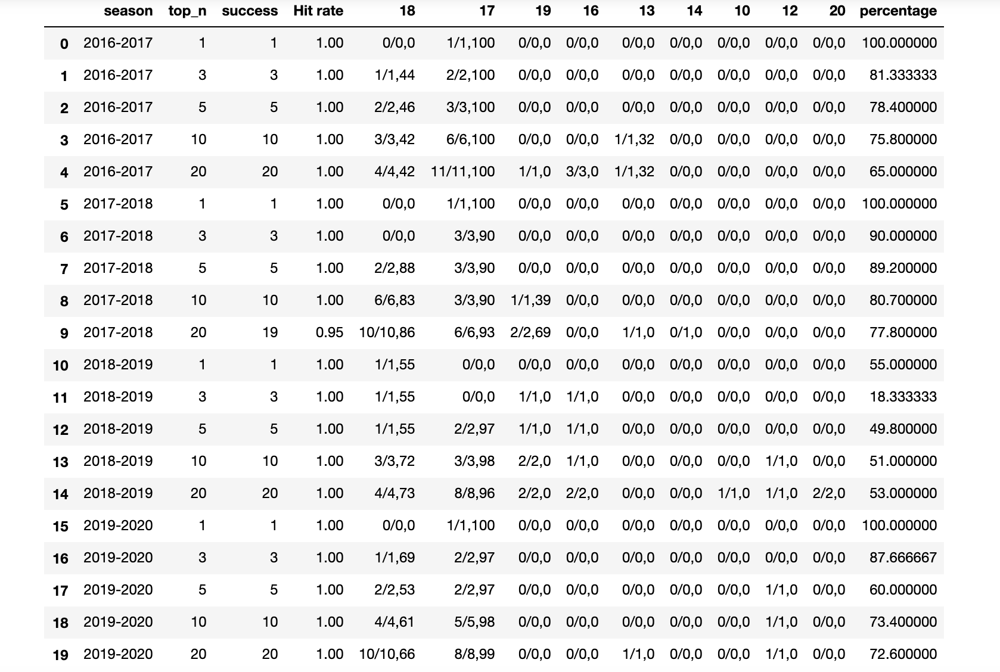

# Hedging-Saving


[](https://travis-ci.org/github/chengweilin114/direct_capstone2020)
[](https://opensource.org/licenses/MIT)
[](http://hits.dwyl.com/chengwei0114/direct_capstone2020)


Introduction: Enel X has customers that participate in a special system peak program aimed at optimizing cost of energy in batteries. In this program, if Enel X storage or load is dispatched by our customers (ie, make their electricity load small) during the five highest hour long peaks in the year of the total grid, Enel X is rewarded at approximately $100/kW. The system peak program was designed by the local utility to lower peak electricity load on the grid. Thus, Our goal is working on a project that will help Enel X ‘s customers to fully utilize the battery capacity and optimize the electricity cost.

## Table of Contents


- [Organization of the project](#Organization-of-the-project)
- [Software Dependencies](#Software-Dependencies)
- [Project Data](#Project-Data)
- [Documentation](#Documentation)
- [Installation](#Installation)
- [Licensing](#Licensing)


## Organization of the project

The project has the following structure:

    direct_capstone2020/
      |- codes/
        |- adjust_probs.py
        |- data_functions.py
        |- dataloader.py
        |- evaluate.py
        |- summarize.py
      |- database/
        |- small_forecast.csv
        |- small_master.csv
      |- docs/
        |- Gantt Chart.png
        |- Project_proposal.pdf
        |- use_cases
      |- examples/
        |- example.pdf
        |- tutorial.py
      |- images/
        |- battery.jpg
      |- results/
        |- overall_report.csv
        |- report_probs_to_use_1.csv
        |- report_probs_to_use_2.csv
        |- report_probs_to_use_3.csv
        |- report_probs_to_use_4.csv
        |- report_probs_to_use_5.csv
        |- report_probs_to_use_6.csv
        |- report_probs_to_use_7.csv
        |- report_probs_to_use_8.csv
        |- report_probs_to_use_9.csv
        |- report_probs_to_use_10.csv
        |- report_probs_to_use_11.csv
        |- report_probs_to_use_12.csv
      |- tests/
         |- test_data_functions.py
      |- .gitignore
      |- .travis.yml
      |- LICENSE
      |- README.md
      |- environment.yml     

## Software Dependencies

- Python 3
- Use `environment.yml` to create an environment


## Datasets
In this project, we mainly use three datasets, the actual demand data in the last four years, the top 2 forecasts of peaks on each day, and the top 12 forecasts of peaks on each day. The shared link to the datasets is [link](https://drive.google.com/drive/folders/1ifAAAHJH6qRNGLICNbKe5Nt7yFHf-pTQ?usp=sharing)


## Documentation

`Hedging-Saving/data_functions.py`

This module contain functions to retrieve and process data from the database folder. 
With all these functions, we can predict our peak hour more accurate. 

```
from Hedging-Saving import * 		            # import module

data_functions.Accuracy(master_df,forecast_df) 	    # input two csv files and generate a new dataframe with "performance" and "hit rate" in each season.
```

Output:



## Installation

Below are the steps to install this package:
1. Clone this repo to the computer: `git clone https://github.com/chengweilin114/direct_capstone2020`

2. In the repo directory install and the environment:
```
conda env create -f environment
conda activate environment
```

## Licensing


We use the MIT license to maintains copyright to the authors.
