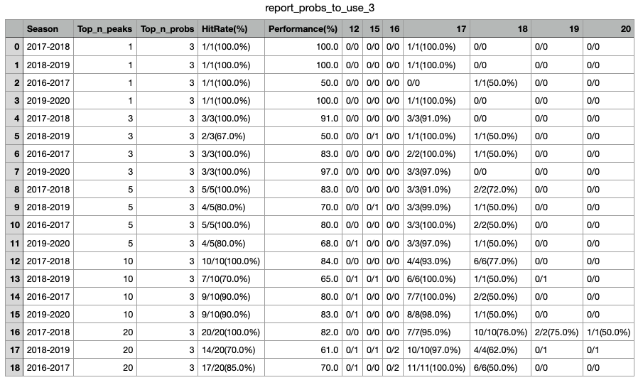
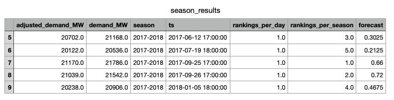
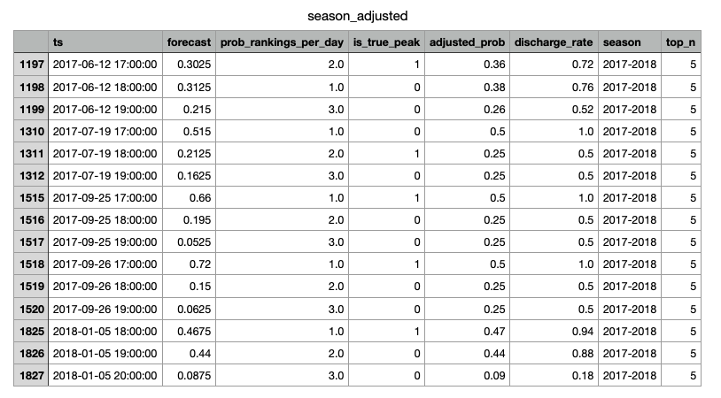
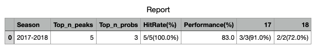
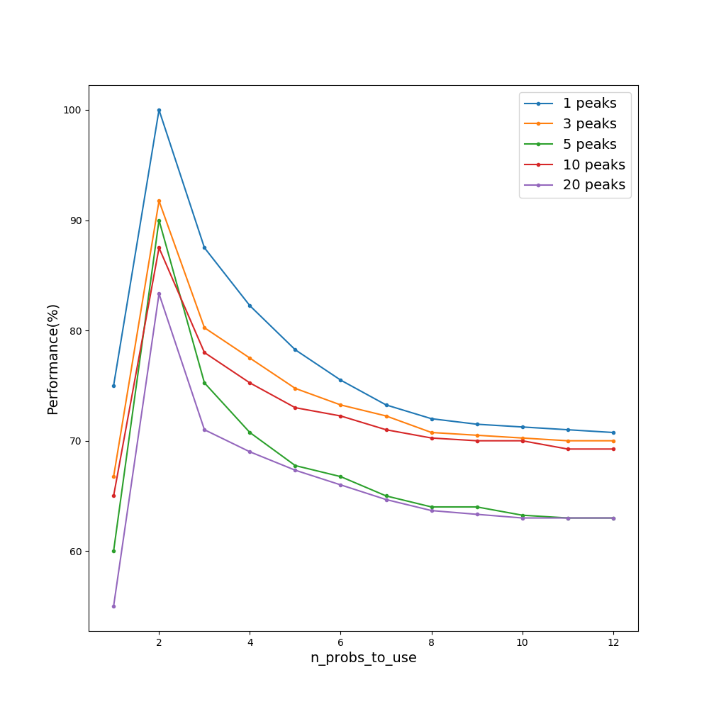

# Hedging-Saving


[](https://travis-ci.org/github/chengweilin114/direct_capstone2020)
[](https://opensource.org/licenses/MIT)
[](http://hits.dwyl.com/chengwei0114/direct_capstone2020)


Enel X has customers to participate in a special system peak program. By using backup batteries for energy discharge in peak hours, on one hand, this program is aimed to minimize electricity bills for customers; on the other hand, Enel X can be rewarded at approximately $100/kW for each unit of load reduced during the five highest hour long peaks in the year of the total grid. The system peak program was designed by the local utility to lower peak electricity load on the grid. Our goal is to help Enel X ‘s customers find the best battery discharging strategy in order to fully utilize the battery capacity and minimize the electricity cost.

## Table of Contents


- [Project Organization](#Project-Organization)
- [Software Dependencies](#Software-Dependencies)
- [Installation](#Installation)
- [Datasets](#Datasets)
- [Function Specifications](#Function-Specifications)
- [Demo](#Demo)
- [Spread Battery Capacity over Different Number of Hours](#Spread-Battery-Capacity-over-Different-Number-of-Hours)
- [Licensing](#Licensing)


## Project Organization

    direct_capstone2020/
      |- codes/
        |- adjust_probs.py
        |- data_functions.py
        |- dataloader.py
        |- evaluate.py
        |- summarize.py
      |- database/
        |- small_forecast.csv
        |- small_master.csv
      |- docs/
        |- Gantt Chart.png
        |- Project_proposal.pdf
        |- use_cases
      |- examples/
        |- example.pdf
        |- tutorial.ipynb
      |- images/
        |- battery.jpg
      |- results/
        |- overall_report.csv
        |- report_probs_to_use_1.csv
        |- report_probs_to_use_2.csv
        |- report_probs_to_use_3.csv
        |- report_probs_to_use_4.csv
        |- report_probs_to_use_5.csv
        |- report_probs_to_use_6.csv
        |- report_probs_to_use_7.csv
        |- report_probs_to_use_8.csv
        |- report_probs_to_use_9.csv
        |- report_probs_to_use_10.csv
        |- report_probs_to_use_11.csv
        |- report_probs_to_use_12.csv
      |- tests/
         |- test_data_functions.py
         |- test_dataloader.py
         |- test_summarize.py
         |- test_adjust_probs.py
         |- test_evaluate.py
      |- .gitignore
      |- .travis.yml
      |- LICENSE
      |- README.md
      |- environment.yml     

## Software Dependencies

- Python 3
- Use `environment.yml` to create an environment

## Installation

Below are the steps to install this package:
1. Clone this repo to the computer: `git clone https://github.com/chengweilin114/direct_capstone2020`

2. In the repo directory install and the environment:
```
conda env create -f environment
conda activate environment
```

## Datasets
In this project, we use three datasets, the actual demand data in the last four years, i.e., `ieso_ga_master_dataset_allWeather_updated2020.csv`, the top 2 forecasts of peaks on each day, i.e., `ga_forecasts_top_2.cvs`, and the top 12 forecasts of peaks on each day, i.e., `ga_forecasts_top_12`. The shared link to the datasets is [link](https://drive.google.com/drive/folders/1ifAAAHJH6qRNGLICNbKe5Nt7yFHf-pTQ?usp=sharing).

In the `database` folder, users can find a sample of actual demand data and the forecasting results to play with.


## Function Specifications
### Use the sample data from `database` folder
    direct_capstone2020/
      |- codes/
        |- data_functions.py

This module contain functions to retrieve and process data from the `database` folder. 
With all these functions, we can predict our peak hour more accurate. 

```
from Hedging-Saving import * 		            # import module

data_functions.ccuracy(master_df,forecast_df) 	    # input two csv files and generate a new dataframe with "performance" and "hit rate" in each season.
```

Output:



### Use complete datasets from [link](https://drive.google.com/drive/folders/1ifAAAHJH6qRNGLICNbKe5Nt7yFHf-pTQ?usp=sharing)
    direct_capstone2020/
          |- codes/
            |- dataloader.py - Load the actual demand data and forecasts.
            |- summarize.py - Generate a table to show accuracy of forecasting. 
            |- adjust_probs.py - Choose number of top forecasts to use and adjust to sum up to one.
            |- evaluate.py - Evaluate different discharging strategies.
            
#### Summarize forecasting accuracies
```
peaks_df = get_actual_peaks(actual_load)
```
* Arguments
    * actual_load: downloaded actual demand data.
* Output
    * A dataframe with all peaks.

```
top_n_results, _ = summarize_top_n(peaks_df, forecasts, n_peaks_to_use)
```
* Arguments
    * peaks_df: peaks generated from `get_actual_peaks` function.
    * forecasts: downloaded forecasting results.
    * n_peaks_to_use: user-specified number of top peaks in a season to discharge, for example, n_peaks_to_use=3 means discharging the battery in top 3 peaks in a season.
* Output
    * top_n_results: summarized forecasting accuracies.
    
#### Discharge in proportional to probabilities
```
top_n_forecasts = get_top_n_forecasts(forecasts, n_probs_to_use)
```
* Arguments
    * forecasts: downloaded forecasting results.
    * n_probs_to_use: user-specified number of top forecasting probabilities to use on each peak day, for example, n_probs_to_use=3 means looking at the 3 largest forecasting probabilities on each peak day and discharge within those hours
* Output
    * Selected top n_probs_to_use forecasts.

```
top_n_adjusted = adjust_probs(top_n_results, top_n_forecasts, n_peaks_to_use, n_probs_to_use)
```
* Arguments
    * top_n_results: summarized forecasting accuracies generated from 'summarize_top_n' function.
    * top_n_forecasts: selected top n_probs_to_use forecasts.
    * n_peaks_to_use: user-specified number of top peaks in a season to discharge.
    * n_probs_to_use: user-specified number of top forecasting probabilities to use on each peak day.
* Output
    * top_n_adjusted: adjusted forecasting probabilities and discharging rate in proportional to probabilities.

```
report_df = get_report(actual_load, forecasts, n_probs_to_use)
```
* Arguments
    * actual_load:
    * forecasts: downloaded forecasting results.
    * n_probs_to_use: user-specified number of top forecasting probabilities to use on each peak day.
* Output
    * report_df: report on performance of different discharging strategies.
    
## Demo
### Use the sample data from `database` folder and try to play with tutorial.ipynb from `examples` folder
    direct_capstone2020/
      |- codes/
        |- data_functions.py
      |- examples/
        |- tutorial.ipynb

## Spread Battery Capacity over Different Number of Hours
### Step 1
We choose the top n peaks (n days) in each season, and choose the hours with the largest k forecasted probabilities on each of these days.

### Step 2
We adjust the chosen probabilities to have them sum up to one for each day.

### Step 3
We discharge the battery in proportional to the adjusted probabilities. Since the capacity of the battery is 2-hours, the maximum amount that can be discharged is 0.5. If the probability is p%, we discharge p% of 0.5 capacity. Then the discharged energy is p% of 0.5.

If one of the probabilitis on some day is larger than 0.5, i.e., p > 0.5, we only discharge 50% of 0.5 capacity, and spread out the remaining capacity in the rest hours evenly. 

For example, if we use the 3 largest probabilities on each day, and the probabilities are 0.6, 0.1, 0.3, then we discharge 0.5/0.5=100%, 0.25/0.5=50%, 0.25/0.5=50% at each hour, repectively.

### Step 4
We eavaluate the performance of this strategy by using the ratio of the total energy we successfully discharge and the total number of peaks we use. The more closer this ratio is to 100%, the better performance we have.

### Example of top_n_results


This is part of the top_n_results dataframe for **top 5 peaks** in the **season 2017-2018**, with **3 peaks at 17:00:00** and **2 peaks at 18:00:00**.

-   **demand_MW**: demand in Megawatts for each hour
-   **adjusted_demand_MW**: demand after adjusting in Megawatts for each hour
-   **season**: year-based cycle, from last year's Mar. 31 to next year's Apr. 1
-   **ts**: date-time
-   **rankings_per_day**: rankings of adjusted demand in a day
-   **rankings_per_season**: rankings of adjusted demand in a season
-   **forecast**: forecasted probability of being the peak hour on that day

### Example of top-n-adjusted


This is part of the top_n_adjusted dataframe for for **"season: 2017-2018, top_n_peaks: 5, top_n_probs: 3"**.

-   **prob_rankings_per_day**: rankings of forecasted probabilities in a day
-   **is_true_peak**: if this hour is the ground-truth peak
-   **adjusted_prob**: adjusted probabilities in the selected top $k$ probabilities (here, k = 3)
-   **discharge_rate**: energy discharged in proportional to adjusted probabilities, i.e., probability/0.5
-   **top_n_peaks**: number of top peaks to use

The three peaks at **17:00:00** in the **season 2017-2018** all appear in the table "season_adjusted", so all three are hitted, the hit rate is **3/3** for **"season: 2018-2018, hour: 17, top_n_peaks: 5"**.

The two peaks at **18:00:00** in the **season 2017-2018** both appear in the table "season_adjusted", so both are hitted, the hit rate is **2/2** for **"season: 2017-2018, hour: 18, top_n_peaks: 5"**.

The total hit rate for **"season: 2017-2018, top_n_peaks: 5"** is **5/5(100%)**. 

### Example of Report


This is part of the overall report for **"season: 2017-2018, top_n_peaks: 5, top_n_probs: 3"**. The complete reports for different seasons, top_n_peaks and top_n_probs can be found in `results` folder.

-   **HitRate(%)**: x/y(p%) means we discharge the battery successfully for x out of y peak hours. p% = x/y*100 %.
-   **17**: x/y(p%) means we discharge the battery successfully for x out of y peak hours which appears at 17:00:00 and the average discharged energy for each of these x peak hours is p%.
-   **18**: x/y(p%) means we discharge the battery successfully for x out of y peak hours which appears at 18:00:00 and the average discharged energy for each of these $x$ peak hours is p%.
-   **Performance(%)**: displays the ratio of the total energy we successfully discharge and the total number of peaks we use, i.e., (91% * 3 + 72% * 2)/5=83.4%. Since the number of peaks we use (i.e., 5) is fixed, to make the performance 100%, we need to successfully discharge 100% for each of these 5 peaks. Therefore, the more closer to 100%, the better performance. 

### Overall performance


This figures shows the performance changes as we increase n_probs_to_use for different choices of n_peaks_to_use.

* When n_probs_to_use=1, we only discharge the battery in the hour with the highest probabilitiy. This is the conventional discharging strategy and is provided as the benchmark for us to compare against.
* When n_probs_to_use=2, we obtain the best performance for all values of n_peaks_to_use. 
* As we continue increasing n_probs_to_use, we spread the battery capacity over more hours and the energy discharged in each hour can decrease. This explains why the performance degrades as we increase n_probs_to_use. However, for n_peaks_to_use>1, no matther how large n_probs_to_use is, discharging in proportional to probabilities always outperforms the benchmark strategy.


## Licensing


We use the MIT license to maintains copyright to the authors.
